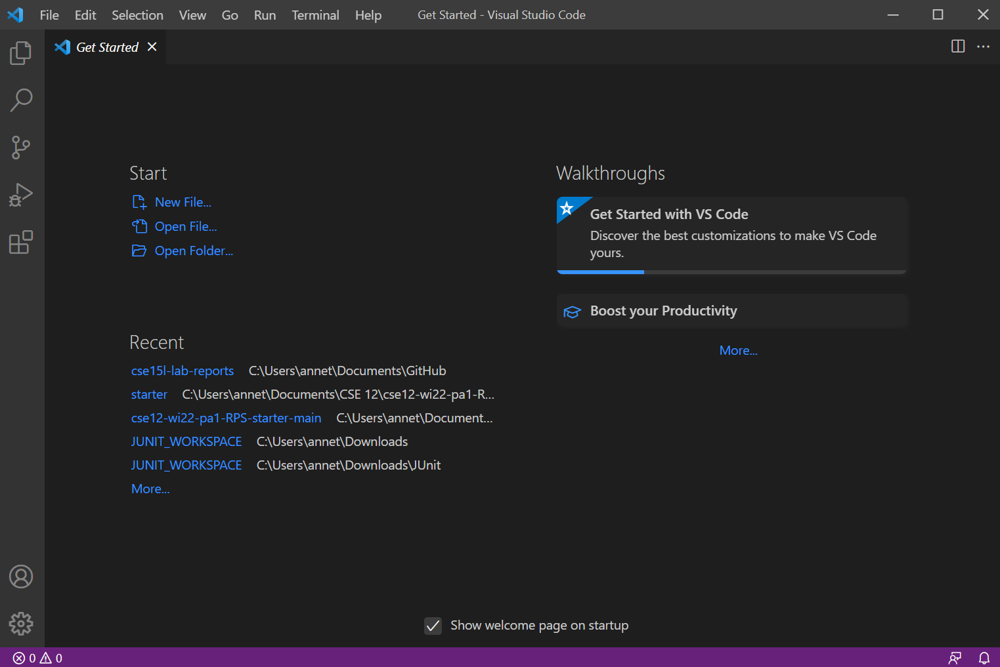

# Lab Report 1
## Remote Access and the Filesystem
In this lab report, we will be learning about remote access and the filesystem. The following steps are specific to computers with a Windows operating system.

There are two parts to remote access:

1. Client
2. Server

The **client** is the computer from which an individual works on, while the **server** is another computer or super computer. In remote access, the client connects to the server and can run processes on the server. Processes include running the files and programs sent by the client to the server.

In order to send files, programs, and more to the server, we must first establish the remote access. To do so, we must take the following steps.

### 1. Installing Visual Studio Code
Before we can remotely connect, we require a platform. For this lab, we will use Visual Studio Code. Please download [VSCode](https://code.visualstudio.com/).

After downloading and opening the download, you should expect to see the following image appear:

### 2. How to Remotely Connect
For computers with a Windows operating system, we must first install OpenSSH. OpenSSH is a program that connects the computer to other computers.
For Windows Server 2019 and Windows 10 devices take the following steps to install OpenSSH:

1. Open **Settings**

2. Select **Apps > Apps & Features**, then select **Optional Features**

3. Search for **OpenSSH Client** and click **Install** *OR* search for **OpenSSH Server** and click **Install**

After installing, the first step to remotely connect in a CSE course is to retrieve your course-specific account, which can be found at this link: [https://sdacs.ucsd.edu/~icc/index.php](https://sdacs.ucsd.edu/~icc/index.php).

The account should look similar to this, with the censored parts containing different letters:

Then, on VSCode, open a new terminal. To open a new terminal, go to the bar at the top of VSCode and click on the tab terminal. A dropdown will appear, from which you should select new terminal. After opening a new terminal, enter in the following command:

    ssh cs15lwi22<letters>@ieng6.ucsd.edu
*The element after the five is the letter 'l' and not the number one.*

If you are connecting for the first time, the message you will receive after entering the command above is a confirmation of whether or not you want to continue connecting. In which case, you should enter 'yes'. Then after putting your password for your course-specific account, you should see the following:

The image above indicates that your computer, the **client**, is connected to the remote computer on campus, the **server**.

### 3. Commands
There are commands that can be used on the client and on the server.

These are a few commands and their descriptions:

* ssh : the command needed to connect the client to the server (short for **S**ecure **Sh**ell). This command provides the client a shell/terminal connection to send commands to the server.
* cd : (**C**urrent **D**rive) moves you to the named directory when the directory is named after this command.
* ls : (**l**i**s**t) provides a list of all the files in that directory.
    * ls -a : (list **a**ll) returns all the files  including the hidden files in the working directory.

* pwd : (**P**rint **W**orking **D**irectory) returns the path of the working directory including the root of that directory.
* cat : (con**cat**enate) returns the content of the file named after the command.
* exit / Ctrl-D : logs you out of the remote server.

### 4. Moving Files to SSH using scp
Aside from just those few commands on the remote server, we can also send files from the client to the server. We can copy over file(s) using the **scp** command.

To do so, we must first log out of the server and work on our own computer. Create a java file on VSCode and save it onto your computer.

Then type in the following command line:

    scp <file-name>.java cs15lwi22<letters>@ieng6.ucsd.edu:~/

In my case, I created a file named *WhereAmI.java*. When I typed in the command, I was prompted for a password. I inputted the password for my course-specific account and received the following output:

After the scp command, try the ssh command again. After logging in successfully, try the *ls* command on the remote server to see your successfully copied file.

*There is a difference in running a file on your computer and on the server, which can be shown using a file that contains the .getProperty method. The returned value will be different if the file is run on the client rather than the server since that method is used to read system properties.*
### 5. Creating/Setting an SSH Key
To shorten the amount of time needed to ssh into the server, we can set up an SSH key, which allows us to bypass the enter password prompt each time we scp or ssh.

To set up the SSH key, logout of the server and work from the client.

Type in the following commands:
    
    ssh-keygen

Then, you should see the following output:

You should fill in the red space after prompted.

After providing the file to save the key, you will get:

In this case, you can put in any passphrase you would like.

After confirming your password, you will see the following image:

For a Windows device, we must take the following steps to create a SSH key.

1. Open **_Administrator_: Windows Powershell**, NOT **Windows Powershell**
2. Type the following command:

        Get-Service ssh-agent | Set-Service -StartupType Manual
3. Followed by this command:
       
        Start-Service ssh-agent
4. Followed by this command:

        Get-Service ssh-agent

Following these steps should look like this:

When prompted again in the Administrator: Windows Powershell, use this command to add your key:

    ssh-add <file>

In my case, I entered the path to my key.

After completing all these steps, when you ssh into the server or scp your files, you will no longer be prompted to insert your password.

### 6. Optimizing Remote Running
To optimize remote running you can do any of the following:

*  **autosave** your files in vscode so every edit you make after creating the file will be saved
* **create ssh key** so you don't have to put in your password every time you use the ssh or scp command
* **use quotes** around commands when you ssh or scp. This will allow you to run multiple commands in a single line.

* **use up/down key arrows** to automatically set your input to previous responses, so you don't have to retype the entire command into the command line

These are just a few suggestions to optimize remote running.