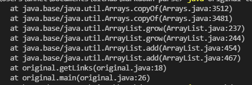
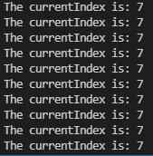
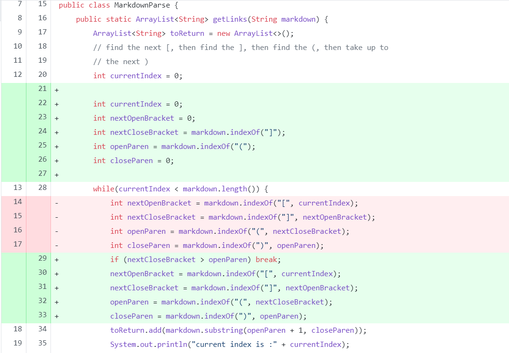
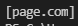
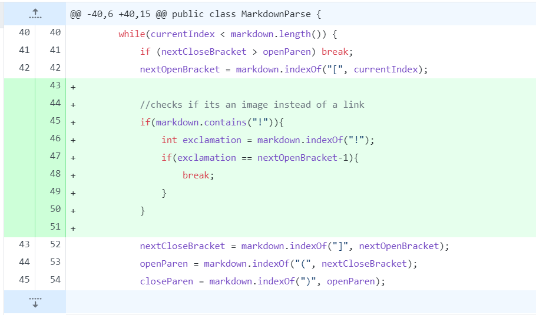
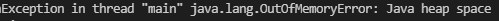
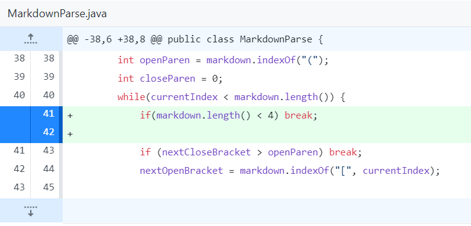

# Lab Report 2
## Incremetal Programming and Debugging
For this lab report, the key terms are:

1. Failure-inducing input: the test edge cases for our code
2. Symptom: the error that is produced when running the code using the failure-inducing input
3. Bug: the error within the code that produces the symptom

### 1. Test Case 1
This is the *failure-inducing input*: [test-file2.md](test-file2.md)

The *symptom* of that failure-inducing input is:

When we add a **System.out.println("The current index is: " + currentIndex)** in the code, we can see that there is an infinite loop, which is a *symptom*:

As a result, we need to make the following code changes to MarkdownParse.java file.

The *failure-inducing input* contains a link that is written with the incorrect syntax in which the parentheses are in between the brackets. Since the link is written incorrectly, the *symptom* of running the code is an infinite loop. This infinite loop is due to the *bug* of trying to find the index of the open and close parenthesis after the index of the next closed bracket, which means that those indexes are never found so the while loop will never end.

### 2. Test Case 2
This is the *failure-inducing input*: [test-file6.md](test-file6.md)

The *symptom* of that failure-inducing input is:

As a result, we need to make the following code changes to MarkdownParse.java file.

The *failure-inducing input* is a markdown page that contains an image link rather than a website link. Since the image link is only different than a website link by having a **!** before the brackets, the *symptom* of running the code is the image link being outputted, when there should not be an output at all. This incorrect output is due to the *bug* of not checking that an exclamation point comes right before the bracket which would have indicated that the following link is an image instead of a website.

### 3. Test Case 3
This is the *failure-inducing input*: [test-file7.md](test-file7.md)

The *symptom* of that failure-inducing input is:

As a result, we need to make the following code changes to MarkdownParse.java file.

The *failure-inducing input* is a markdown that only contains a parenthesis and a bracket. Since there is no link and not even the proper setup for a link, the *symptom* of running the code is an exception in the heap space. This symptom is a result of the *bug* of not checking whether or not there are the right amount of parentheses and brackets.

