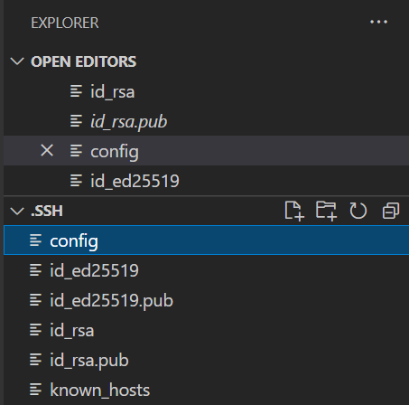
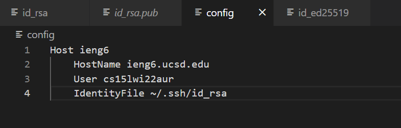
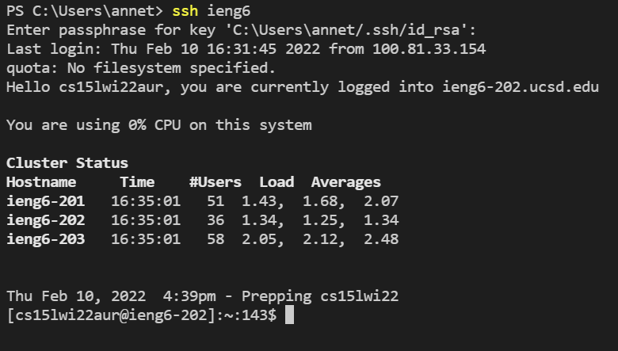
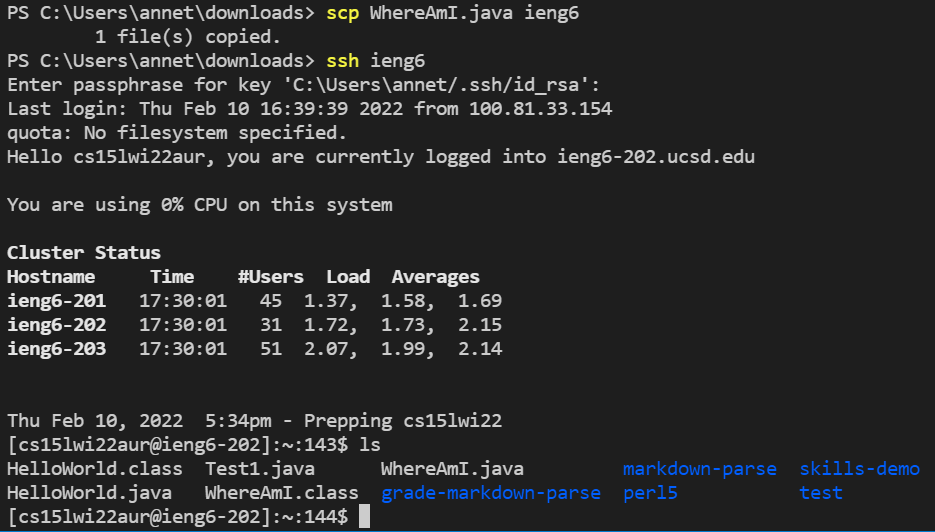

# Lab Report 3

## Streamlining ssh Configuration

First create a config text file in the .ssh directory, which should like the below image.

Within this file, add the following text:

In the image above, I added the host, hostname, my username, and the private key name. The "IdentityFile" refers to my private key.

Now, I can ssh with "ieng6" instead of having to type out my entire username. This is the result I get when I ssh now.

Additionally, I now type less when I scp a file as can be seen below.

In the image, when I check the remote server, I can find my copied file.

After streamlining ssh configuration, I can now easily scp and ssh without having to type out my entire username.