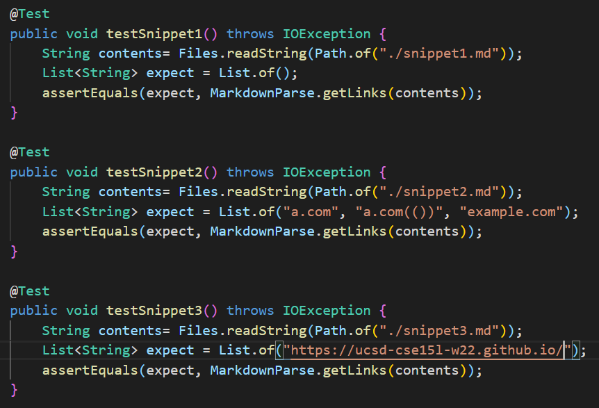
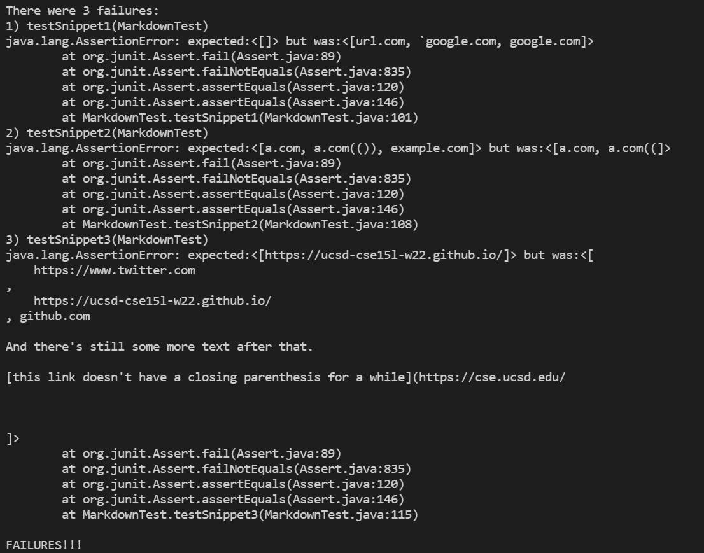
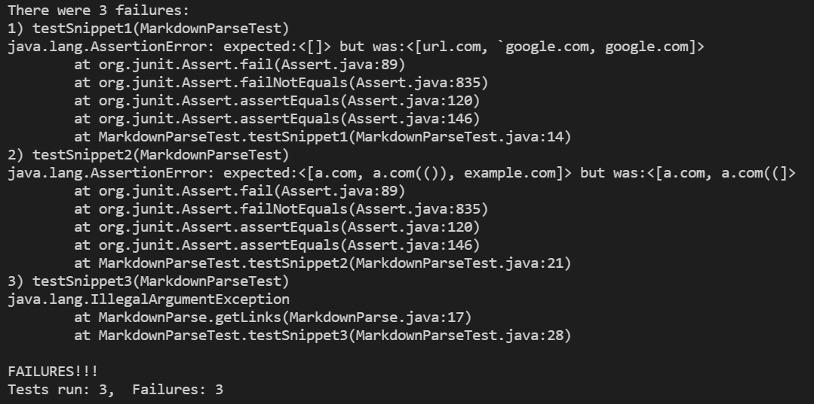

# Lab Report 4

## Markdown Snippets

My MarkdownParse Repo Link:
[https://github.com/jtanurdjaja/markdown-parse.git](https://github.com/jtanurdjaja/markdown-parse.git)

The reviewed MarkdownParse Repo Link:
[https://github.com/5ean-github/markdown-parse.git](https://github.com/5ean-github/markdown-parse.git)

Based on the CommonMark demo site, the snippets provided in the lab report should have the following output when MarkdownParse is run:

1. Snippet 1:
[]

2. Snippet 2:
[a.com, a.com(()), example.com]

3. Snippet 3:
[https://ucsd-cse15l-w22.github.io/]

For my and the reviewed MarkdownParse repositories, I wrote the following tests in the MarkdownParseTest.java file:

For my implementation:

My implementation failed the three testers that corresponded with the three snippets. The above images show the specific part of the JUNit output that shows the test failure. The failures are numbered one to three and contain the names of the tests: testSnippet1, testSnippet2, testSnippet3. Each failure provides a stack frame that lists the lines of code in which the code failed, including a comparison between the expected and the actual values produced by the MarkdownParse code.

For the implementation I reviewed:

The implementation that I reviewed did not pass any of the tests that was written for the snippets. The specific part of the JUnit output that shows the test failure is shown above and labeled 1 to 3 with the following headers: testSnippet1, testSnippet2, testSnippet3. Each failure provides the expected and the actual value that the MarkdownParse code provided, including a stack frame that shows the lines where the code failed.

Questions:

1. Do you think there is a small (<10 lines) code change that will make your program work for snippet 1 and all related cases that use inline code with backticks?

I think there is a small code change that will make my program work for snippet 1 and all related cases that use inline code with backticks. Simply add a conditional statement that checks if there are backticks in the syntax of the link. If a backtick does exist right before or in between the parentheses and/or brackets of the syntax of the link, then add a break command that would prevent that link from being added to the returned array.

2. Do you think there is a small (<10 lines) code change that will make your program work for snippet 2 and all related cases that nest parentheses, brackets, and escaped brackets?

I think that the program will require greater change in order to work for snippet 2 and all realted cases. Since my program is already checking for parentheses and brackets, the program will have to be changed to account for additional parentheses and brackets. This cannot simply be fixed with conditional statements, rather the code will have to keep track of the pairs of brackets and parentheses before deciding whether the syntax is correct and return the correct link.

3. Do you think there is a small (<10 lines) code change that will make your program work for snippet 3 and all related cases that have newlines in brackets and parentheses?

I think that a greater code change will have to be implemented to make my program work for snippet 3 and all related cases that have newlines in brackets and parentheses because there are several code changes that are needed that will most likely exceed 10 code line changes. First, an additional conditional statement should be added to check that there are bracket pairs and parentheses pairs. If there is a bracket before the second parenthesis, or a parenthesis before the end bracket, the program should stop running. The next code change should be taking the contents within the brackets and parenthesis and splitting those contents by "\n". Then, check the returned array to see if it has a length greater than one, which indicates whether or not the link has more than one line break. If the link has more than one break, the program should stop running. As can be seen by this description, my solution to this test case will probably need more than a small change in order for the program to work.