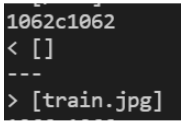

# Lab Report 5

## Comparing Implementations & More Debugging

During Lab 9, the two implementations of MarkdownParse that were being compared were mine and the one provided during lab. The output for my implementation and the given implementation contained some differences for some of the test files. My implementation's output is the first output, while the given implementation's output comes second.

# Test 1

The first difference can be seen in below:

This corresponds to test-file577.md which contains the following line:

    

Based on the outputs, my implementation seems to give the correct output because the output the other implementation gave contains a ".jpg" extension. This extension indicates that this line is actually an image and not a link. Thus, my implementation is correct in not outputting that line in the test-file.

The given implementation doesn't check if the "link" given is actually an image. To fix this, add an if statement in the while loop that checks whether or not an "!" exists right before the first open brackets. If the "!" exists, then don't run the while loop. This if statement should be placed in between line 15 and 16, so that the while loop will not run at all.

# Test 2

The second difference can be seen below:

This corresponds to test-file194.md which contains the following line:

    [Foo*bar\]]:my_(url) 'title (with parens)'

Based on the outputs, my implementation is correct since the link syntax is incorrect in the test-file. Thus, the given implementation of MarkdownParse is incorrect.

The given implementation should add a check for if an open parenthesis comes right after the closed brackets. If it doesn't, the while loop should stop. This code change should be placed in between line 16 and 17, so that the while loop will stop since the syntax is incorrect.

